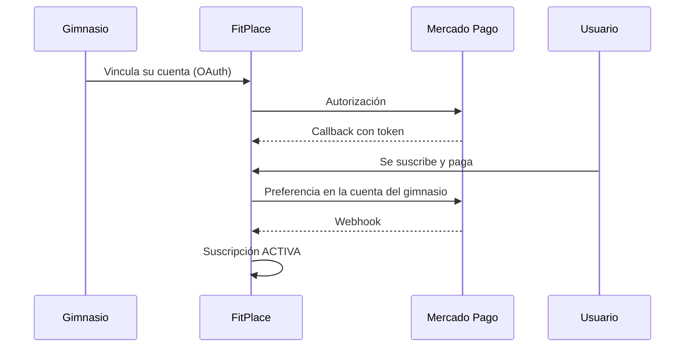

<a id="top"></a>

<div align="center">

# 🏋️ FitPlace

App para entrenar, seguir tu progreso y gestionar gimnasios.


[Estructura](#estructura) · [Features](#features) · [Instalación](#instalación) · [API](#api) · [Tests](#tests) · [Equipo](#equipo)

</div>

---

## Estructura

```
FitPlace/
├── backend/    API REST (Spring Boot + MySQL)
└── frontend/   App web (Angular 22)
```

## Features

- 📋 **Rutinas** por días, con rutina activa y "rutina de hoy"
- 📈 **Entrenamientos**: registro, historial por ejercicio y volumen semanal
- 🏆 **Récords personales** y ranking
- 🧑‍🏫 **Entrenadores y alumnos**, con asignación de rutinas
- 🤝 **Amigos** por código
- 🏢 **Gimnasios** con suscripciones cobradas vía **Mercado Pago**
- 🔐 **JWT** con roles: `USUARIO`, `ENTRENADOR`, `ADMIN_GIMNASIO` y `ADMIN`

## Instalación

### Backend

Requiere **Java 17** y **MySQL** con una base `gymtracker` en `localhost:3306`.

```bash
git clone https://github.com/NicoFerreyra06/FitPlace.git
cd FitPlace/backend
./mvnw spring-boot:run
```

Queda corriendo en `http://localhost:8080`.

### Frontend

Requiere **Node 22+**.

```bash
cd FitPlace/frontend
npm install
npm start
```

Queda corriendo en `http://localhost:5173` (el puerto que el backend tiene habilitado en CORS).

<details>
<summary><b>Variables de entorno</b></summary>

<br>

| Variable | Descripción |
|---|---|
| `MYSQLUSER` | Usuario de MySQL |
| `MYSQLPASSWORD` | Contraseña de MySQL |
| `JWT_SECRET_KEY` | Clave para firmar los tokens |
| `MERCADOPAGO_CLIENT_SECRET` | Client secret de Mercado Pago *(pagos)* |
| `MERCADOPAGO_WEBHOOK_SECRET` | Secret de los webhooks *(pagos)* |
| `MERCADOPAGO_NOTIFICATION` | URL pública para notificaciones *(pagos)* |
| `MERCADOPAGO_URL_RETURN` | URL del front post-pago (default `http://localhost:5173`) |

</details>

<details>
<summary><b>Con Docker</b></summary>

<br>

```bash
cd backend
docker build -t fitplace .
docker run -p 8080:8080 \
  -e MYSQLUSER=root -e MYSQLPASSWORD=secret \
  -e JWT_SECRET_KEY=una-clave-larga \
  fitplace
```

</details>

## API

Documentación interactiva en **[`/swagger-ui.html`](http://localhost:8080/swagger-ui.html)**.

Salvo registro, login y los `GET` de ejercicios y músculos, todo requiere `Authorization: Bearer <token>`.

<details>
<summary><b>Endpoints</b></summary>

<br>

| Recurso | Ruta |
|---|---|
| Auth | `POST /usuarios/registro` · `POST /usuarios/login` |
| Usuarios | `/usuarios` |
| Amigos | `/usuarios/me/amigos` |
| Rutinas | `/rutinas` |
| Entrenamientos | `/entrenamientos` |
| Récords | `/records` |
| Ejercicios / Músculos | `/ejercicios` · `/musculos` |
| Gimnasios | `/gimnasios` |
| Suscripciones / Pagos | `/suscripciones` · `/pagos` |
| Mercado Pago | `/mercadopago/vincular/{idGimnasio}` · `/webhook/mercadopago` |

</details>

<details>
<summary><b>Flujo de pagos</b></summary>

<br>



</details>

## Tests

```bash
cd backend && ./mvnw test      # backend: H2 en memoria
cd frontend && npm test        # frontend
```

El reporte de cobertura del backend (JaCoCo) queda en `backend/target/site/jacoco/index.html`.

## Equipo

[@NicoFerreyra06](https://github.com/NicoFerreyra06) · [@Juanfran06](https://github.com/Juanfran06) · [ver todos](https://github.com/NicoFerreyra06/FitPlace/graphs/contributors)

---

<div align="center">

[↑ Volver arriba](#top)

</div>
